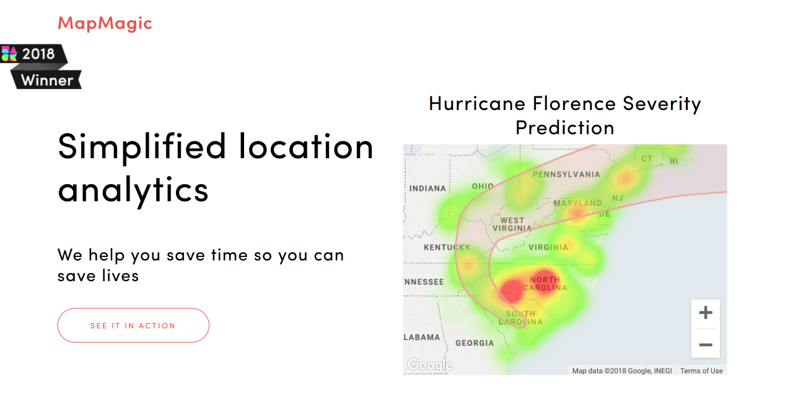

# Resq/MapMagic: 
Winner of HackMIT 2018 Best Disaster Preparedness & Relief Solutions for IBM Call for Code Challenge \
https://devpost.com/software/disaster-rescue-github-io.

Predicting natural disaster severity with Twitter activity.

<kbd></kbd>

HackMIT 2018 \
Team "Meat Magic" \
Table J5 
  
### Teammates
[Connie Ye](https://github.com/khanniie) \
[Megan Ung](https://github.com/meganung) \
[Ke Shang](https://github.com/ksmaybe) \
[Andrew Hu](https://github.com/andrewhu)

